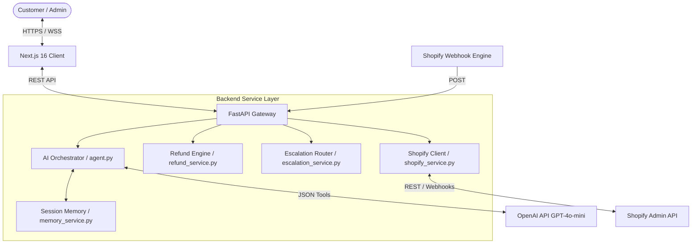
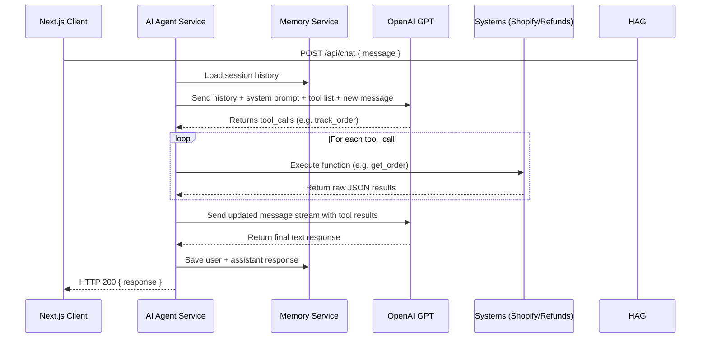
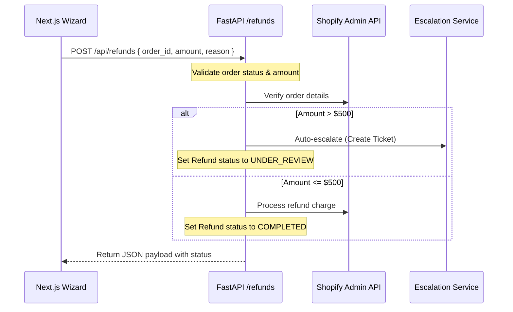

# CommerceMind-AI — Technical Specification Document

This document outlines the system architecture, design patterns, and engineering details of the **CommerceMind-AI** customer support platform.

---

## 1. System Architecture

CommerceMind-AI uses a decoupled, three-tier micro-architecture optimized for real-time AI tool-calling and graceful degradation under API failures.



---

## 2. Frontend Architecture

The frontend is built using **Next.js 16.2** (App Router) and **React 19**, styled with **Tailwind CSS v4** utilizing modern CSS custom properties.

### Key Characteristics:
*   **Static Shell / Client Pages**: All key views (`/chat`, `/orders`, `/refunds`, `/escalations`) are configured as `"use client"` components to support instant interactive states, client-side filtering, and lazy loading of modal wizards.
*   **Zero-Dependency Design**: Avoids bloated graphing and state packages (e.g., Redux, ChartJS). UI elements like progress trackers and performance charts are built with semantic CSS and tailwind utilities.
*   **Component Structure**:
    *   `Header` / `Sidebar`: Layout navigation and search states.
    *   `OrderTimeline`: Renders order progress paths using conditional Tailwind-driven SVGs.
    *   `StatCard`: High-performance dashboard metrics using CSS stagger transitions.

---

## 3. Backend Architecture

Built with **FastAPI (ASGI)** and **Uvicorn**, optimized for asynchronous, non-blocking I/O operations.

### Core Modules:
*   **API Layer (`/routers`)**: Implements strict Pydantic model validation. Routes are divided logically by domain: `chat.py`, `orders.py`, `refunds.py`, `escalations.py`, and `webhooks.py`.
*   **Service Layer (`/services`)**: Business logic is separated into singletons instantiated via dependency injection ([dependencies.py](file:///c:/Users/KIIT0001/Desktop/CommerceMind-AI/backend/app/dependencies.py)). This ensures loose coupling and clear unit testing boundaries.
*   **Configuration (`config.py`)**: Uses Pydantic `BaseSettings` for environment variable binding, ensuring that missing configurations default safely to mock systems.

---

## 4. AI Orchestration

The system utilizes an agentic loop powered by OpenAI's JSON Tool Calling schema.



*   **Recursion Guard**: The secondary (follow-up) prompt to the LLM has tools omitted. This prevents infinite agent loops.
*   **Context Window Management**: History is maintained using a FIFO sliding window limited to 50 messages, preventing context bloat and token-runaway charges.

---

## 5. Shopify Integration

The [ShopifyService](file:///c:/Users/KIIT0001/Desktop/CommerceMind-AI/backend/app/services/shopify_service.py) operates in two distinct modes:

1.  **Online Mode**: Communicates with the Shopify Admin REST API (`2024-01`) using `httpx.AsyncClient` with custom keep-alive settings.
    *   Implements rate-limit parsing via `X-Shopify-Shop-Api-Call-Limit` headers to enable back-off strategies.
2.  **Offline (Fallback) Mode**: Operates on a structured memory store when credentials are unconfigured or Shopify APIs are down, ensuring zero system downtime during demos.

---

## 6. API Flow

### Example: Order Refund Lifecycle



---

## 7. State Management

*   **Frontend State**: Uses local ephemeral state (`useState`) coupled with local-storage syncs for chat session IDs.
*   **Backend State**: Stored in volatile memory singletons (`MemoryService`, `RefundService`, `EscalationService`).
    *   *Note*: The current configuration is optimized for single-instance, high-speed execution, but requires a redis/database adapter for multi-instance scaling.

---

## 8. Error Handling

The application separates operational errors from system failures:

1.  **Validation Errors**: Caught at the API boundary by Pydantic; returns `HTTP 422 Unprocessable Entity` with JSON-detailed fields.
2.  **Domain Errors**: Validations (e.g., attempting illegal state transitions on a completed refund) raise a `ValueError` in the service layer, which the router translates to a `HTTP 400 Bad Request`.
3.  **Third-Party System Errors**: Outages in Shopify/OpenAI are handled within services using broad try/catch clauses, allowing the system to gracefully fall back to local mock layers.

---

## 9. Fallback Systems

*   **LLM Fallback**: If the OpenAI client raises connection or credential errors, the agent falls back to a deterministic regex keyword engine ([ai_agent.py](file:///c:/Users/KIIT0001/Desktop/CommerceMind-AI/backend/app/services/ai_agent.py)) to handle basic tracking and refund queries.
*   **API Mock Fallback**: When `SHOPIFY_ACCESS_TOKEN` is unset or invalid, operations automatically toggle to the in-memory dataset, matching exact data structures to preserve frontend integrity.

---

## 10. Escalation Logic

The [EscalationService](file:///c:/Users/KIIT0001/Desktop/CommerceMind-AI/backend/app/services/escalation_service.py) handles transitioning support requests from AI to human operations.

*   **Trigger Conditions**:
    1.  *Rule-Based*: Refund request exceeds `$500.00`.
    2.  *Agentic*: AI detects high sentiment frustration or complex request patterns and triggers the `escalate_to_human` tool.
*   **Priority-Based Routing**:
    *   `CRITICAL` -> Auto-assigned to Team Lead (`Team Lead - Sarah K.`)
    *   `HIGH` / `MEDIUM` / `LOW` -> Auto-routed to appropriate shared pools.
*   **Audit Logging**: Every transition state, comment, or assignment change writes a permanent chronological entry to the ticket's `audit_log` array.

---

## 11. Security Considerations

*   **Webhook Signature Verification**: Handled in [webhooks.py](file:///c:/Users/KIIT0001/Desktop/CommerceMind-AI/backend/app/routers/webhooks.py). Computes a HMAC-SHA256 digest of the raw request payload using `SHOPIFY_WEBHOOK_SECRET` and matches against the incoming `X-Shopify-Hmac-SHA256` header.
*   **Input Sanitization**: Rich text descriptions and customer notes are run through a regex-based HTML/script stripper in [helpers.py](file:///c:/Users/KIIT0001/Desktop/CommerceMind-AI/backend/app/utils/helpers.py) to mitigate XSS risks.
*   **Credential Leak Prevention**: Environment loaders validate prefix signatures (e.g., checks that keys don't match default placeholder patterns).

---

## 12. Failure Handling

| Failure Point | Impact | Recovery Pattern |
|---|---|---|
| **OpenAI Timeout** | Chat offline | Intercept exception, output dynamic mock replies using local keyword analyzer |
| **Shopify API Rate Limit** | Slow/failed syncs | Parse `X-Shopify-Shop-Api-Call-Limit` and apply exponential backoff |
| **Invalid State Transition** | Process locks | Reject requests with `HTTP 400` + descriptive state mismatch error |

---

## 13. AI vs. Deterministic Logic Boundary

To ensure reliability and auditability, a clear line separates what the AI "decides" and what is executed programmatically:

```
                  [ USER INPUT ]
                        │
                        ▼
                [ AI ORCHESTRATOR ]  <-- Natural Language Parsing / Tool Intent
                        │
       ┌────────────────┴────────────────┐
       ▼ (Tool Calls Requested)           ▼ (Conversation)
[ DETERMINISTIC LOGIC ENGINE ]      [ DYNAMIC RESPONSE GENERATOR ]
 - Refund State Machine Validations  - Policy Explanations
 - Priority Allocation Maps          - Polite Greetings
 - Shopify API Calls                 - Context Assembly
```

*   **Deterministic**: State transitions (e.g., `APPROVED` -> `COMPLETED`), assignment routing tables, currency calculations, and HMAC verifications. The AI cannot bypass validation states; it must call the API endpoints which enforce these rigid states.
*   **AI (Dynamic)**: Intent classification, sentiment analysis, entity extraction (e.g. finding a tracking code in a user sentence), and synthesis of API responses into customer-friendly explanations.

---

## 14. Known Limitations

*   **Vulnerability to Reset**: Memory is stored exclusively in Python process dictionaries; restarting the backend service resets all conversations, refunds, and escalations.
*   **Webhook HMAC Comparison Mismatch**: The current HMAC checker compares hex digests directly against Shopify's base64-encoded header, which will fail under live conditions.
*   **StatCard CSS Bug**: The frontend `StatCard` trend logic paints negative trends in positive green.
*   **System Message Redirection**: System messages in history mapping are routed to OpenAI as `assistant` instead of `system` role type.

---

## 15. Future Improvements

1.  **State Persistence**: Transition the in-memory data store to a PostgreSQL database with an ORM layer (SQLAlchemy) and Redis for chat session caching.
2.  **Webhook Repair**: Standardize the HMAC check in `helpers.py` to correctly verify Shopify's base64-encoded headers.
3.  **Real Shopify Refunds**: Connect the `RefundService` approval trigger to execute a real transaction refund API call on Shopify.
4.  **WebSocket Support**: Migrate the chat framework from short-polling HTTP POST requests to a stateful WebSocket connection for instant streaming responses.
5.  **Multi-Tenant RBAC**: Add identity providers (e.g., Auth0, Clerk) to separate tenant customer sessions from admin workspace views.
